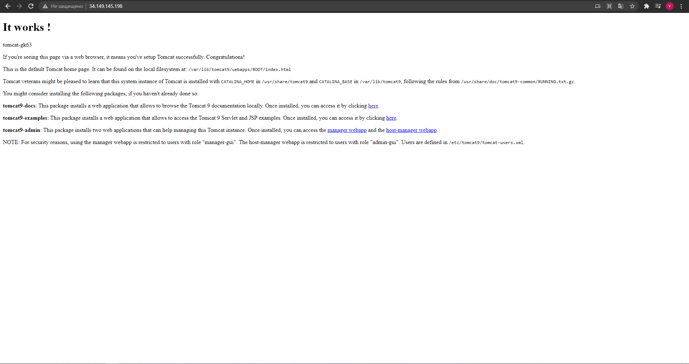
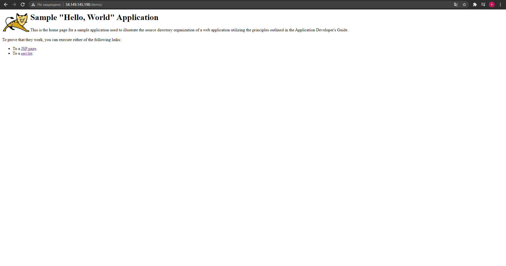
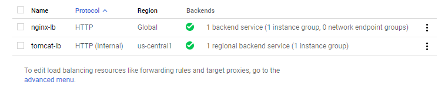
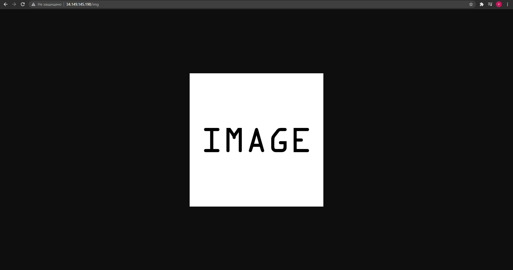

# Task 1 #

- Link to bucket.tf [file](./Task1/buckets.tf)
- Link to main.tf [file](./Task1/main.tf)
- Link to nginx config [file](./Task1/default)

1.  Create bucket for application files and another one for static web files.

   Two buckets were created. first bucket containing config files and sample application. This bucket is private and not allowed for access from internet. For access to bucket we need to use service account. Also we need to attache role to this account. So i have used Terraform and `google_storage_bucket_iam_member` resource to define ReadOnly role. Second bucket was created like a public and anyone can access to object by Url.

2. Create MIG for backend with installed tomcat and on boot download demo application from bucket.

  First time it was a problem to create MIG without any problems. Every time i have forgot something and i needed to recreate MIG.
  So i used Terraform for Creating template and MIG. And every time when i need to create or destroy infrastructure she was the same like in first time.

3. setup autoscaling buy CPU

  We can setup autoscaling by several ways. So  i used Google Console and just setup autoscaling by CPU. And when load achieve 80% the new instance is creating. The minimum number of scaling is a 1 and the maximum is a 3.

4. Create LB

  I have tried to create both LB by using Terraform. But i was getting errors from outputs. So i decide just create LB in Console.
  For this we create backend with instance group. We need to point out on port which will be listened and create health check for machines. For frontend we point on the IP and Port.

  The structure is that internal LB manages traffic on the tomcat instances. External LB manages traffic on the Nginx instances. Nginx is setup like a reverse proxy server and proxy the internal lb.

  `tomcat_group <=> internal LB <=> nginx_group <=> etxernal LB`

5. add one more MIG for frontend with nginx, by path /demo/ show demo app from bucket, by path /img/picture.jpg show file from bucket

  I used Terraform for creating Nginx MIG. It is the same MIG like a tomcat group but the first have different startup script. Every nginx instance have a service account for access to bucket. We setup to access to a Tomcat by path /demo /img.

6. setup export of nginx logs to bucket/BigQuery

  I setup log agent on the instances but  i'm in procces of finding the way to export logs to BigQuery.
  

