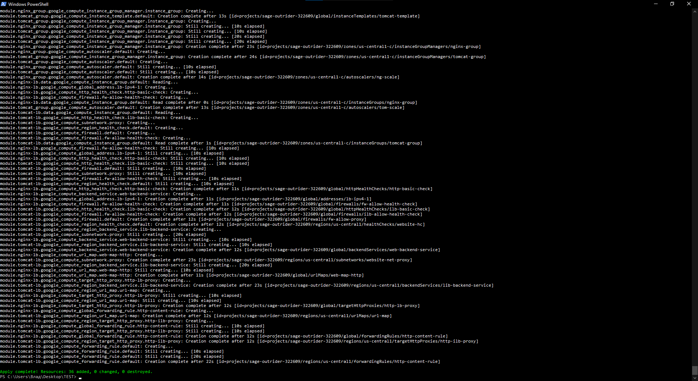
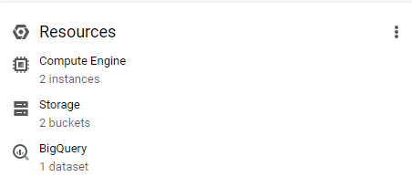

# **Task 2**

 Structure of project:

 - [main.tf](./main.tf)                
 - [variables.tf](./variables.tf)
 - [files](./files/)
 - [modules](.modules/)
   - [bucket](./modules/bucket/main.tf)
   - [external_http_lb](./modules/external_http_lb/main.tf)
   - [backend_instance_group](./instance_group/main.tf)
   - [internal_http_lb](./modules/internal_http_lb/main.tf)


**1.** **Export logs to BiqQuery**

- To export logs from Nginx VM, we need to install the agent and set up the configuration to send logs to the BigQuery dataset. But we need to automate the installation and configuration because we are using autoscaling. So we just use a script to install on each virtual machine.
```
sudo curl -L https://toolbelt.treasuredata.com/sh/install-debian-buster-td-agent4.sh  | sh
sudo usermod -aG adm td-agent
sudo /usr/sbin/td-agent-gem install fluent-plugin-bigquery
sudo gsutil cp gs://backend-storage-44/td-agent.conf /etc/td-agent/td-agent.conf
sudo systemctl restart td-agent
```

**2.** **Changing backend OS**

- We can't change OS without terminated VM because our MIG based on instance template. If we need to change so we destroy infrastrature with `terraform destroy` After that we need to change source code
```
module "tomcat_group" {

  # We need replace ubuntu image on centos
  source_image         = "ubuntu-2004-lts"  =>  source_image = "centos-8"
  # We need replace startup script to install soft
  startup_script = file("files\\tomcat.sh") =>  startup_script = file("files\\tomcat-c.sh")
}
```

 - When we execute `terraform apply` so we will get new instances with a new OS

**3.** **Health check on 20x status code**

 - For this we just need to apply the http health check
```
resource "google_compute_region_health_check" "default" {
  provider = google-beta

  region = var.region
  name   = "website-hc"
  http_health_check {
    port_specification = "USE_SERVING_PORT"
  }
}
```

The output  of applying



Created resources


